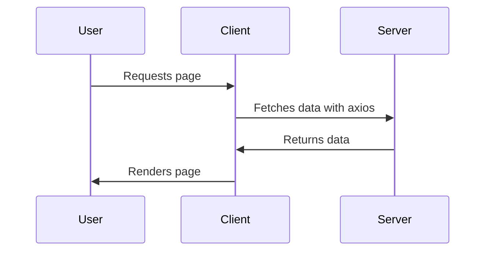
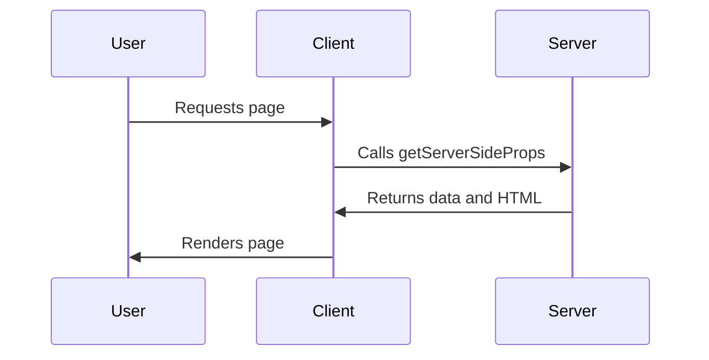
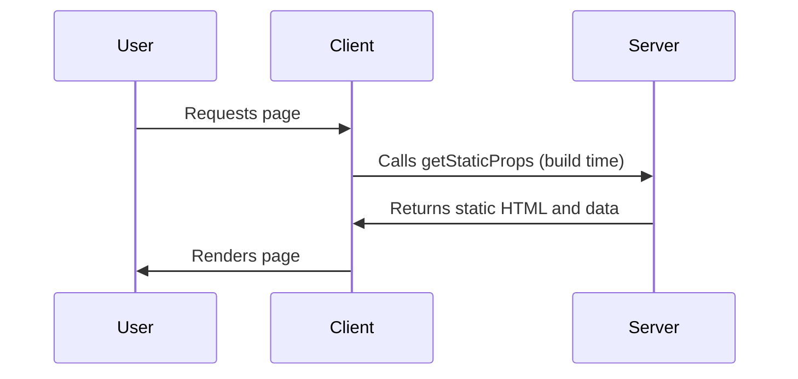
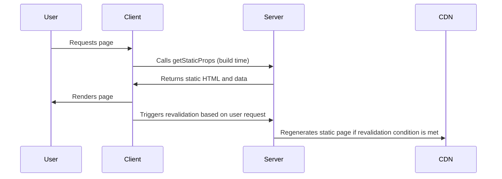

# Next.js Rendering Optimization

## Introduction
This repository demonstrates and compares four different data fetching strategies in Next.js: **CSR (Client-Side Rendering)**, **SSR (Server-Side Rendering)**, **SSG (Static Site Generation)**, and **ISR (Incremental Static Regeneration)**. Each of these strategies is applied to different pages in the project to optimize page rendering and data fetching, resulting in improved performance, scalability, and SEO.
## Rendering Strategies Overview

### CSR (Client-Side Rendering)


### SSR (Server-Side Rendering)

### SSG (Static Site Generation)

### ISR (Incremental Static Regeneration)

## Pages

1. **CSR (Client-Side Rendering)** - `pages/index.tsx`:  
   - Data is fetched on the client-side using React's `useEffect` hook and `axios` for making HTTP requests.
   - Ideal for pages where data can be fetched after the page loads, such as user dashboards or dynamic content.

2. **SSR (Server-Side Rendering)** - `pages/server.tsx`:  
   - Data is fetched on the server-side on each request using Next.js's `getServerSideProps` method.
   - Suitable for pages that need fresh data on each request, such as user profiles or frequently updated content.

3. **SSG (Static Site Generation)** - `pages/static.tsx`:  
   - Data is fetched at build time using `getStaticProps` and is then cached for static serving.
   - Great for pages with content that doesn’t change often, such as blogs or marketing pages.

4. **ISR (Incremental Static Regeneration)** - `pages/incremental.tsx`:  
   - Data is fetched at build time with the ability to regenerate static pages incrementally based on a defined revalidation period.
   - Combines the benefits of static generation with dynamic updates, suitable for content that changes periodically but doesn’t require full rebuilds.

## Setup

To set up the project locally:

1. Clone the repository:
```bash
   git clone <repository_url>
```
2. Navigate to the project directory:
```bash
cd csr-ssr-ssg-isr-comparison
```
3. Install dependencies:
```bash
yarn install
```
4. Start the development server:
```bash
yarn dev
```
Visit http://localhost:3000 in your browser to view the project in action.

## Conclusion
By using SSR, CSR, SSG, and ISR, this project demonstrates how to optimize data fetching strategies based on specific use cases. Each strategy helps achieve faster page loading, improved SEO, and better scalability. With ISR, you can update static content dynamically without the need for full site rebuilds, making it a powerful option for modern web applications.
