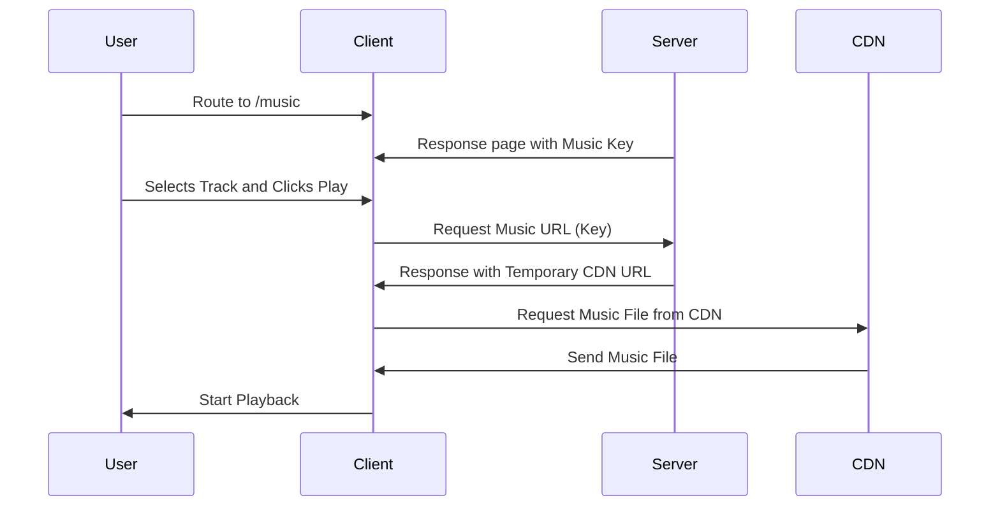
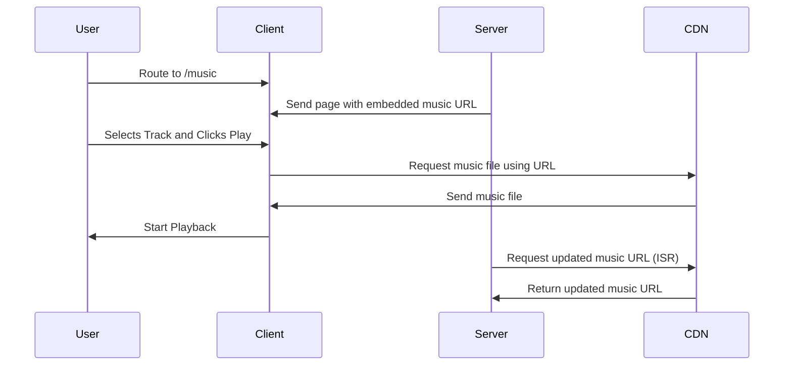

# Optimizing Dynamic Data Updates with ISR in Next.js

## Flow of the Problem and Solution

### Flow with SSR / CSR

### Flow with ISR (Optimized Solution)

## Overview

This project compares different rendering strategies in Next.js — SSR, CSR, SSG, and ISR — to demonstrate the performance benefits and trade-offs for each. The focus is on optimizing media streaming with temporary URLs, particularly for scenarios involving network latency between the server and distant clients.

## Problem Statement

When playing music, the flow was as follows:

1. User selects a track and clicks play.

2. The client requests the music URL through an API.

3. The server responds with a temporary CDN URL.

4. The client requests the music file from the CDN.

5. The music file is downloaded, and playback begins.

❌ Slow playback for users far from the server (e.g., in the U.S.).

❌ Increased server load due to API requests every time a track is played.

## Solution Strategy

We compared SSR, CSR, and ISR to solve the issue and found that ISR was the most effective solution for optimizing performance.

## Conclusion

While SSR seemed like the optimal solution, we discovered that ISR provided the best results for this specific case. By pre-generating static content with ISR and periodically updating the CDN URLs, we could reduce the unnecessary network requests and improve performance.
